# Brick Quest

> Built for the [**4th Agentic AI Hackathon with Google Cloud**](https://zenn.dev/topics/gch4)

AI-powered LEGO brick scanner and 3D build instruction generator.

Scan your LEGO bricks, build an inventory, and get AI-generated step-by-step 3D building instructions — with an **agentic AI loop** that autonomously validates and improves build quality.


---

## How It Works

```mermaid
graph LR
    A["📸 Scan Bricks"] --> B["📦 Build Inventory"]
    B --> C["🤖 AI Generates<br/>3D Build Plan"]
    C --> D["🔧 Physics Engine<br/>Validates"]
    D -->|"❌ Issues Found"| C
    D -->|"✅ Valid"| E["🧱 3D Step-by-Step<br/>Instructions"]
```



1. **Scan** — Take a photo of your LEGO bricks. Gemini AI identifies each part (shape, color, size).
2. **Inventory** — Review detected parts, edit counts, and build your collection.
3. **Build** — Choose a difficulty and optional prompt. AI generates a 3D construction plan.
4. **Validate** — A physics engine checks every brick for overlaps, gravity, and grid alignment.
5. **View** — Step through the 3D build instructions in an interactive Three.js viewer.

---

## Architecture


### Monorepo Structure

```
brick-quest/
├── apps/
│   ├── landing/        Next.js 16 + next-intl     :7030   Static (Firebase Hosting)
│   ├── web/            Next.js 16 + Three.js       :7031   Standalone (App Hosting)
│   └── console/        Next.js 16 + Three.js       :7032   Standalone (App Hosting)
├── packages/
│   ├── shared/         Types, registry, physics, prompts, catalog
│   └── functions/      Cloud Functions (2nd gen)
├── scripts/            Deploy helper scripts
└── .github/workflows/  CI/CD (6 workflows)
```

---

## Agentic AI: Self-Improving Build Generation

Gemini generates 3D LEGO build plans, but raw output often contains **physics errors** — overlapping bricks, floating pieces, invalid positions. Brick Quest solves this with an autonomous agent loop:

```mermaid
graph TD
    A["Gemini AI<br/>Generate Build Plan"] --> B["Physics Engine<br/>Snap + Gravity + Overlap"]
    B --> C{"Quality Check<br/>> 15% bricks dropped?"}
    C -->|"No"| D["✅ Deliver Result"]
    C -->|"Yes"| E["Generate Spatial Feedback<br/><small>which bricks failed, why, how to fix</small>"]
    E --> F{"Iteration < 3?"}
    F -->|"Yes"| A
    F -->|"No"| G["✅ Deliver Best Result"]

    style D fill:#22c55e,color:#fff
    style G fill:#22c55e,color:#fff
```



The physics engine runs 5 phases on every build plan:

| Phase | Name | Description |
|-------|------|-------------|
| 0 | **Snap** | Align dimensions and positions to the stud grid |
| 1 | **Sort** | Order bricks bottom-up by Y position |
| 2 | **Gravity** | Drop floating bricks to nearest support |
| 3 | **Overlap** | Detect collisions, nudge before removing |
| 4 | **Renumber** | Reassign sequential step IDs |

---

## Design Mode (Photo to LEGO)

Upload a reference photo to generate a LEGO version with a 2-stage pipeline:


1. **Stage 1**: Gemini generates composite orthographic views (front, side, top, back)
2. **Stage 2**: User approves views, then Gemini generates a full build plan from them

---

## Getting Started

### Prerequisites

- Node.js 22 (see `.nvmrc`)
- pnpm 9+
- Docker (for Firebase emulators)

### Setup

```bash
# Install dependencies
pnpm install

# Configure environment variables
# apps/web/.env.local       — Firebase web config (NEXT_PUBLIC_FIREBASE_*)
# apps/console/.env.local   — Firebase web config (same keys)
# packages/functions/.env.local — GEMINI_API_KEY (local dev only)

# Start Firebase emulators + all apps
pnpm dev
```

### Local Services

| Service | URL | Description |
|---------|-----|-------------|
| Landing | http://localhost:7030 | Marketing site (en/ko/ja) |
| Web App | http://localhost:7031 | Main application |
| Console | http://localhost:7032 | Admin dashboard |
| Emulator UI | http://localhost:7020 | Firebase emulator dashboard |

### Commands

```bash
pnpm dev                  # All apps + emulators
pnpm dev:web              # Web app only
pnpm dev:landing          # Landing only
pnpm dev:console          # Console only
pnpm build                # Build all
pnpm typecheck            # TypeScript check
pnpm lint                 # ESLint
pnpm firebase:emulators   # Emulators only (Docker)
pnpm firebase:deploy      # Deploy functions to production
```

---

## Cloud Functions

| Function | Type | Description |
|----------|------|-------------|
| `submitScan` | Callable | Upload image, create scan job |
| `submitBuild` | Callable | Parts + difficulty, create build job |
| `submitDesign` | Callable | Reference image, create design job |
| `cancelJob` | Callable | Cancel a pending/processing job |
| `approveDesignViews` | Callable | Approve views, trigger build generation |
| `regenerateDesignViews` | Callable | Re-generate orthographic views |
| `setAdminRole` | Callable | Set admin custom claim |
| `processJob` | Trigger (onCreate) | Orchestrate scan/build/design processing |
| `processDesignUpdate` | Trigger (onUpdate) | Handle design state transitions |

All functions: `region: asia-northeast1` | `memory: 1GiB` | `timeout: 540s`

---

## Deployment


| Service | Platform | Trigger |
|---------|----------|---------|
| Landing | Firebase Hosting (static) | Push to main (if `apps/landing/` changed) |
| Web App | Firebase App Hosting | Push to `deploy/web` branch |
| Console | Firebase App Hosting | Push to `deploy/console` branch |
| Functions | Cloud Functions (2nd gen) | Push to main (if `packages/functions/` changed) |

---

## Tech Stack

| Layer | Technologies |
|-------|-------------|
| **Runtime** | Node.js 22, pnpm 9, Turborepo |
| **Frontend** | Next.js 16, React 19, Tailwind CSS v4 |
| **3D** | Three.js, @react-three/fiber, @react-three/drei |
| **State** | Zustand |
| **Backend** | Firebase Functions (2nd gen), Firestore, Cloud Storage |
| **AI** | Google Gemini 3 Pro (@google/genai) |
| **i18n** | next-intl (English, Korean, Japanese) |
| **UI** | Lucide React, Framer Motion |
| **CI/CD** | GitHub Actions (6 workflows) |
| **Hosting** | Firebase App Hosting, Firebase Hosting |

---

## License

Private
